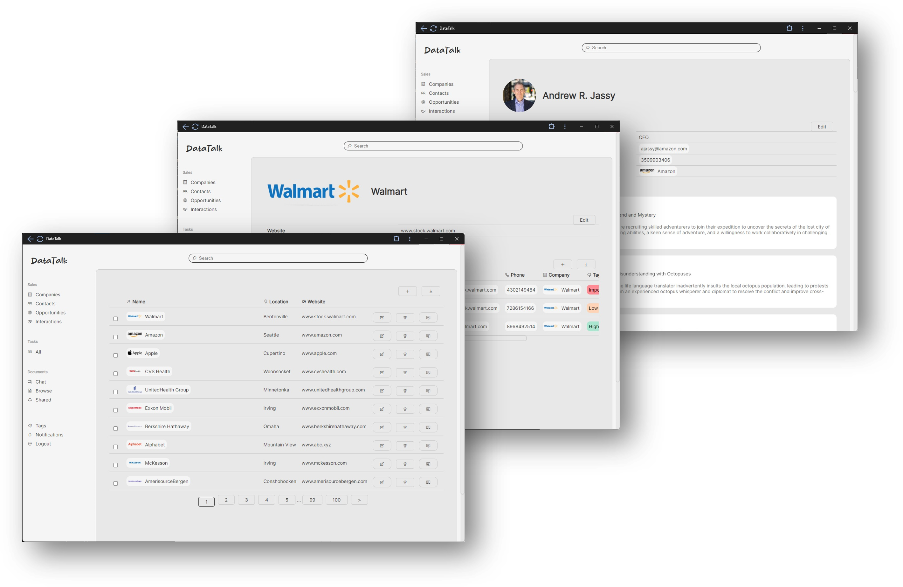
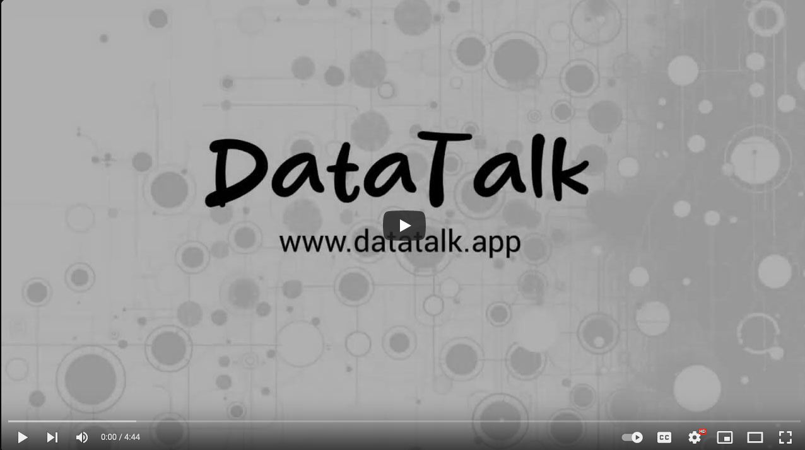
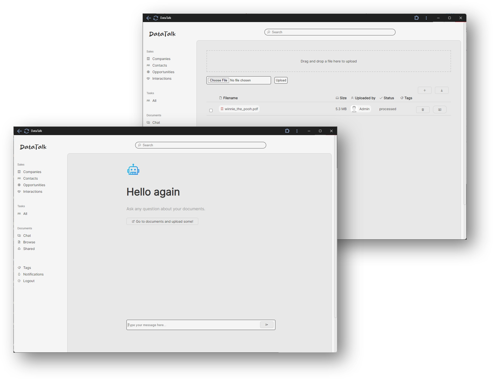

<br>
<p align="center">
  <a href="https://datatalk.app">
    
  </a>
</p>

<h2 align="center" >The AI-native CRM</h3>
<p align="center"><i>Leverage LLMs to scale and grow your business</i></p>

<p align="center"><a href="https://datatalk.app">🌐 Website</a> - <a href="https://www.youtube.com/@DataTalkApp">📺 YouTube</a>
<br />


Welcome to the **GitHub page of DataTalk CRM**, the **AI-native future** of customer relationship management, **built on Large Language Models (LLMs)**. This **open-source tool** is crafted by founders with deep industry insights, aiming to revolutionize CRM with **efficiency and modern AI automation**. DataTalk CRM is designed to not just manage customer relationships but to **automate cumbersome tasks**, leveraging the power of AI and LLMs for a smoother professional experience.




## Product Demo

Explore DataTalk CRM's powerful features and AI-driven capabilities in our concise video tour. Discover how it simplifies customer relationship management and enhances productivity with just a few clicks.

[](https://youtu.be/4aI_MdquyFA)

## Overview

DataTalk CRM is a lightweight yet highly scalable CRM solution designed to meet the needs of businesses of all sizes. At its core, DataTalk CRM uses advanced artificial intelligence to revolutionize how businesses interact with their customers and manage their data. It's built for those who need an efficient way to organize, track, and foster customer relationships without getting overwhelmed by the details.

## Key Features

- **AI-Powered Interaction Summaries:** DataTalk CRM automatically summarizes interactions, ensuring that you never miss out on the important details of a conversation. Whether it's an email exchange, a phone call, or a meeting, our AI technology provides concise summaries that can be quickly reviewed.

- **Automated Notes and Task Creation:** Forget about manually updating records or setting reminders for follow-ups. DataTalk CRM intelligently generates notes from your interactions and automatically creates tasks, helping you stay ahead of your workload without extra effort.

- **Scalability:** Designed with growth in mind, DataTalk CRM scales with your business. It can handle an increasing volume of interactions and documents without compromising performance, making it suitable for startups and large enterprises alike.

- **Document Management System:** Our integrated document management system is not just a repository; it's an interactive environment. Powered by Retriever Answer Generation (RAG), it allows you to chat with your data and documents as if you were conversing with a colleague. This feature makes finding information and extracting insights from your documents as easy as asking a question.



## Why DataTalk CRM?

- We were in search of a CRM solution that could adapt to the changing customer relationship management landscape
- Existing tools were cumbersome, lacked modern features, or weren't scalable enough
- Needed a CRM to automate mundane tasks, provide insightful summaries, and offer a natural data interaction
- DataTalk CRM is designed to meet these needs, enhancing productivity and decision-making through AI
- Automates traditional manual tasks, freeing up time to focus on building and maintaining customer relationships

## Join Our Community

DataTalk CRM is open source, and we believe in the power of community-driven development. We invite you to join us in our journey to continuously improve and expand the capabilities of DataTalk CRM. Whether you're a developer, a business owner, or simply someone interested in the future of CRM, your contributions and feedback are invaluable to us. [Feel free to contact us](mailto:mail@datatalk.app).


### Run with Docker-Compose
```
docker-compose up
```

### Load sample data
Download `sample_data.zip` from releases and extract to the root of the project, overwriting any existing files. It wil>
## One-command deploy to Fly.io
```
fly deploy
```

## Tech stack
- [Python](https://www.python.org/)
- [Flask](https://flask.palletsprojects.com/)
- [SQLite](https://www.sqlite.org/)

## License
DataTalk is licensed under the [AGPL v3](https://www.gnu.org/licenses/agpl-3.0.html) license.
If you need a different license, please [contact us](mail@datatalk.app).


